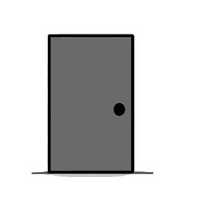
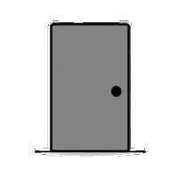
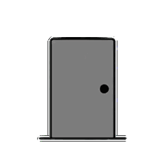
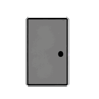

# 🦊 Screen Toy — 桌伴

macOS 桌面宠物。一只名叫**刘看山**的北极狐在屏幕上闲逛、打喷嚏、跳呼啦圈、热化了会融化、拧巴了会挣扎——点击弹出思维气泡菜单，可以快速打开应用，也可以打开 AI 对话窗和知乎直答聊天。

<p align="center">
  
</p>

## 简介

现代年轻人有热情、有活力、敢想敢做，但也同样有压力、有困惑，需要同路人。刘看山不是工具，是蹲在桌面上偶尔说句俏皮话的同伴。

基于知乎直答 API，支持流式对话、搜索上下文折叠、MBTI 16 型人格风格注入。有节日事件动画系统，端午节变粽子、儿童节换新装、母亲节戴花。20 秒随机触发趣味动画，拖到屏幕角落会自己睡觉。

[完整背景 →](background.md)

## 🚀 安装

```bash
git clone https://github.com/wenlei/screen-toy.git
cd screen-toy
npm install
npm run dev
```

或直接下载 DMG：

| 架构 | 下载 |
|------|------|
| Apple Silicon (M1/M2/M3) | [Screen Toy-1.0.0-arm64.dmg](https://github.com/wenlei/screen-toy/releases/download/v1.0.0/Screen%20Toy-1.0.0-arm64.dmg) |
| Intel Mac | [Screen Toy-1.0.0.dmg](https://github.com/wenlei/screen-toy/releases/download/v1.0.0/Screen%20Toy-1.0.0.dmg) |

首次打开右键 → 打开，绕过 Gatekeeper（未签名）。

## 🎬 动画

随机动画每 20 秒自动触发，也可在设置面板一键激活：

<p align="center">
  
  
  
  
  
  
</p>

| 动画 | 触发 | 对话 |
|------|------|------|
| 🌀 别拧巴了 | 手/自动 | 哎呀，我拧巴了！→ 终于不拧了！ |
| 🌺 草裙舞 | 手/自动 | 穿裙子咯~ → 左三圈... → 跳完啦！ |
| 🤧 打喷嚏 | 手/自动 | 阿嚏!!! |
| ☀️ 热化了 | 手/自动 | 好热啊...我化了... |
| 🍎 狐顿 | 手动 | 哎呦！ |
| 🧊 冻成冰棍 | 手动 | 嘶—好冷！→ 冻成冰棍了... |
| 👃 大鼻子 | 手动 | 鼻子变大了？ |
| 🌸 人生亦如是 | 手动 | 花开花落 |
| 🎮 躲太阳 | 开关 | 太阳追赶，离越近分越高 |

### 事件动画（日期驱动）

特定节日自动切换入场/退场形象：

<p align="center">
  
  
  
</p>

| 日期 | 事件 | 入场动画 |
|------|------|----------|
| 05-09 | 端午节 | 粽子北极狐 |
| 05-10 | 母亲节 | 戴花北极狐 |
| 05-28 ~ 06-03 | 儿童节 | 换新装 |

配置文件：`src/assets/doodles/arctic_fox/event_animations.json`，支持单日/日期范围/动画组复用。[详细文档 →](animations.md)

## 💬 AI 对话（刘看山的脑仁儿）

基于知乎直答，流式响应 + Markdown 渲染 + 搜索上下文折叠展示。

<p align="center">
  
</p>

| 功能 | 说明 |
|------|------|
| 💬 多轮对话 | 上下文记忆，Session 持久化 |
| 🔍 自动搜索 | 知乎站内 / 全网搜索 |
| 📝 Markdown | 标题、列表、代码块、粗体、链接 |
| 🔥 热榜 | 一键查看知乎热点，摘要可折叠 |
| 🔄 会话历史 | 下拉框选择、加载、删除历史 Session |
| 📋 复制 | 每条 Bot 回复底部复制按钮 |
| 🔖 收藏 | Bot 回复可收藏到 Session |
| ⚠️ 趣味错误 | 错误用北极狐口吻提示 |

### 对话模型

| 模型 | 说明 |
|------|------|
| zhida-fast-1p5 | 快速回答 (通用) |
| zhida-thinking-1p5 | 深度思考 (推理强) |
| zhida-agent | 智能思考 (规划强) |

## 🧠 回答风格 (MBTI)

4 个维度组合出 16 种人格，风格前缀注入每条用户消息：

| 维度 | Toggle | ENTP 默认 |
|------|--------|----------|
| 表达方式 | E 外向 / I 内向 | E |
| 关注点 | S 实感 / N 直觉 | N |
| 决策方式 | T 思考 / F 情感 | T |
| 风格 | J 判断 / P 感知 | P |

风格变更实时通知对话框，自动记录到 Session 历史。

## 📦 下载

最新版本：**[v1.0.0](https://github.com/wenlei/screen-toy/releases/tag/v1.0.0)**

| 文件 | 架构 | 大小 |
|------|------|------|
| `Screen Toy-1.0.0-arm64.dmg` | Apple Silicon | ~120MB |
| `Screen Toy-1.0.0.dmg` | Intel Mac | ~125MB |

## 📄 文档

| 文档 | 内容 |
|------|------|
| [architecture.md](architecture.md) | 整体架构、IPC、数据流 |
| [background.md](background.md) | 项目背景、想法和方式 |
| [pet.md](pet.md) | 宠物系统、动画注册流程 |
| [dialog.md](dialog.md) | 对话窗口系统 |
| [settings.md](settings.md) | 设置面板/API Key |
| [session.md](session.md) | Session 机制 Spec |
| [animations.md](animations.md) | 事件动画配置指南 |
| [log-wrap-up.md](log-wrap-up.md) | 近期变更记录 |
